**Important Note on Date Formats:**

Throughout this application, date processing logic (especially when identifying date columns in input files) should be flexible. Aim to handle common formats like `YYYY-MM-DD`, `DD/MM/YYYY`, and `YYYY-MM-DDTHH:MM:SS` where appropriate, particularly during initial data loading and column identification steps. While pre-processing steps might standardize dates to `YYYY-MM-DD`, initial parsing should be robust.

ISIN is used as the primary identifier for securities, and is stored in the `w_secs.csv` file.

---

# Simple Data Checker

This application provides a web interface to load, process, and check financial data, primarily focusing on time-series metrics and security-level data. It helps identify potential data anomalies by calculating changes and Z-scores.

## Features

*   **Time-Series Metric Analysis:** Load `ts_*.csv` files, view latest changes, Z-scores, and historical data charts for various metrics per fund.
    *   Optionally loads corresponding `sp_ts_*.csv` files for comparison data
    *   Route: `/metric/<metric_name>` (with toggle switch to show/hide comparison data)

*   **Security-Level Analysis:** Load wide-format `sec_*.csv` files, view latest changes and Z-scores across securities, and drill down into historical charts.
    *   Server-side pagination, filtering (search, dropdowns), and sorting
    *   Routes: `/security/summary` (main page), `/security/details/<metric_name>/<security_id>` (detail view)

*   **Generic Data Comparison:** Compare pairs of security-level datasets (e.g., Spread vs SpreadSP, Duration vs DurationSP).
    *   Configurable via `COMPARISON_CONFIG` in `config.py`.
    *   Provides summary tables with comparison statistics (correlations, differences, date ranges).
    *   Detail view with overlayed time-series charts.
    *   **Detail view also includes a Fund Holdings table showing which funds (from `w_secs.csv`) held the security on the dates displayed in the chart (Green = held with value > 0, Red = not held/zero/blank).**
    *   Features server-side filtering (including held status), sorting, and pagination.
    *   Routes: `/compare/<comparison_type>/summary`, `/compare/<comparison_type>/details/<security_id>`

*   **Fund-Specific Views:**
    *   General Fund Overview (`/fund/<fund_code>`): All metrics with comparison data toggle
    *   Fund Duration Details (`/fund/duration_details/<fund_code>`): Duration changes for securities

*   **Security Exclusions:** Manage exclusion list via `/exclusions` (stored in `Data/exclusions.csv`)

*   **Data Issue Tracking:** Log, view, and manage data issues via `/issues` (stored in `Data/data_issues.csv`)
    *   Features user selection dropdowns (from `Data/users.csv`), an optional Jira link, and enhanced fund/source options.

*   **Weight Check:** Compare fund and benchmark weights via `/weights/check`

*   **Yield Curve Analysis:** Check curve inconsistencies via `/curve/summary` and `/curve/details/<currency>`

*   **Attribution Residuals Summary:** Analyze attribution data via `/attribution`
    *   3-way toggle (L0, L1, L2) for different detail levels
    *   Compares Production vs S&P data for both Benchmark and Portfolio cases
    *   Color-coded cells to highlight discrepancies

*   **Data Simulation & Management:** API simulation via `/get_data`

*   **Special Character Handling:** Security IDs with special characters are URL-encoded in templates and decoded in view functions using `urllib.parse.unquote(security_id)`

*   **Attribution Residuals Chart:** Time-series visualization of attribution residuals

## File Structure Overview

```mermaid
graph TD
    A[Simple Data Checker] --> B(app.py);
    A --> C{Python Modules};
    A --> D{Views};
    A --> E{Templates};
    A --> F{Static Files};
    A --> G(Data);
    A --> H(Config/Utils);

    C --> C1(data_loader.py);
    C --> C2(metric_calculator.py);
    C --> C3(security_processing.py);
    C --> C4(process_data.py);
    C --> C5(curve_processing.py);
    C --> C6(issue_processing.py);
    C --> C7(weight_processing.py);
    C --> C8(data_validation.py);
    C --> C9(process_w_secs.py);
    C --> C10(process_weights.py);

    D --> D1(main_views.py);
    D --> D2(metric_views.py);
    D --> D3(security_views.py);
    D --> D4(fund_views.py);
    D --> D5(exclusion_views.py);
    D --> D7(weight_views.py);
    D --> D8(api_views.py);
    D8 --> D8a(api_core.py);
    D8 --> D8b(api_routes_data.py);
    D8 --> D8c(api_routes_call.py);
    D --> D11(curve_views.py);
    D --> D12(issue_views.py);
    D --> D13(attribution_views.py);
    D --> D14(generic_comparison_views.py);

    E --> E1(base.html);
    E --> E2(index.html);
    E --> E3(metric_page_js.html);
    E --> E4(securities_page.html);
    E --> E5(security_details_page.html);
    E --> E6(fund_duration_details.html);
    E --> E7(exclusions_page.html);
    E --> E8(get_data.html);
    E --> E11(fund_detail_page.html);
    E --> E12(weight_check.html);
    E --> E17(curve_summary.html);
    E --> E18(curve_details.html);
    E --> E19(issues_page.html);
    E --> E20(attribution_summary.html);
    E --> E21(comparison_summary_base.html);
    E --> E22(comparison_details_base.html);

    F --> F1(js);
    F1 --> F1a(main.js);
    F1 --> F1b(modules);
    F1b --> F1b1(ui);
    F1b1 --> F1b1a(chartRenderer.js);
    F1b1 --> F1b1b(securityTableFilter.js);
    F1b1 --> F1b1c(tableSorter.js);
    F1b1 --> F1b1d(toggleSwitchHandler.js);
    F1b --> F1b2(utils);
    F1b2 --> F1b2a(helpers.js);
    F1b --> F1b3(charts);
    F1b3 --> F1b3a(timeSeriesChart.js);

    G --> G1(ts_*.csv);
    G --> G2(sec_*.csv);
    G --> G3(pre_*.csv);
    G --> G4(new_*.csv);
    G --> G5(exclusions.csv);
    G --> G6(QueryMap.csv);
    G --> G7(FundList.csv);
    G --> G8(w_Funds.csv);
    G --> G9(w_Bench.csv);
    G --> G10(curves.csv);
    G --> G11(data_issues.csv);
    G --> G12(w_secs.csv);
    G --> G13(att_factors.csv);
    G --> G14(users.csv);

    H --> H1(config.py);
    H --> H2(utils.py);

    B --> D;
    D --> C;
    D --> H;
    D --> E;
    E --> F;
```



## Application Components

### Data Files (`Data/`)

| File | Description |
|------|-------------|
| `ts_*.csv` | Time-series data indexed by Date and Code (Fund/Benchmark) |
| `sp_ts_*.csv` | (Optional) Secondary/comparison time-series data corresponding to `ts_*.csv` |
| `sec_*.csv` | Security-level data in wide format (dates as columns). Used for Securities Check and Comparisons. |
| `pre_*.csv` | Input files for the `process_data.py` script |
| `new_*.csv` | Output files from the `process_data.py` script |
| `exclusions.csv` | Excluded securities list (`SecurityID`, `AddDate`, `EndDate`, `Comment`) |
| `QueryMap.csv` | Maps query IDs to filenames for API simulation |
| `FundList.csv` | Fund codes and metadata for the API simulation page |
| `Dates.csv` | Configuration data for specific use cases |
| `w_Funds.csv` | Daily fund weights (expected to be 100%) |
| `w_Bench.csv` | Daily benchmark weights (expected to be 100%) |
| `w_secs.csv` | Security weights with ISIN as primary identifier. Used to determine currently held securities. |
| `curves.csv` | Yield curve data (Date, Currency Code, Term, Daily Value) |
| `data_issues.csv` | Issue tracking log (ID, dates, users, details, resolution, Jira link) |
| `att_factors.csv` | Attribution data with L0, L2 factors for Production and S&P. **Note:** The `L0 Total` column represents the returns for each security/fund/date. |
| `users.csv` | List of users for issue tracking dropdowns (`Name` column) |

### Python Core Modules

| File | Purpose | Key Functions |
|------|---------|--------------|
| `app.py` | Application entry point using Flask factory pattern | `create_app()`, `run_cleanup()` |
| `config.py` | Configuration variables | `DATA_FOLDER`, `COLOR_PALETTE`, `COMPARISON_CONFIG` |
| `data_loader.py` | Load and preprocess time-series data | `load_and_process_data()`, `_find_column()` |
| `metric_calculator.py` | Calculate statistical metrics | `calculate_latest_metrics()`, `_calculate_column_stats()` |
| `process_data.py` | Preprocess CSV files | `process_csv_file()`, `main()` |
| `security_processing.py` | Process security-level data | `load_and_process_security_data()`, `calculate_security_latest_metrics()` |
| `utils.py` | Utility functions | `_is_date_like()`, `parse_fund_list()`, `load_weights_and_held_status()` |
| `curve_processing.py` | Process yield curve data | `load_curve_data()`, `check_curve_inconsistencies()` |
| `issue_processing.py` | Manage data issues (load, add, close) using `data_issues.csv` and `users.csv` | `add_issue()`, `close_issue()`, `load_issues()` |
| `weight_processing.py` | Process and clean weight files, replacing generic headers with dates from Dates.csv for fund, benchmark, and security weights. | `process_weight_file()` |
| `process_weights.py` | Batch process all weight files in Data/, converting pre_w_*.csv to w_*.csv with correct date headers. | `main()`, `process_weight_file_with_reversed_dates()`, `process_securities_file()` |
| `process_w_secs.py` | Process pre_w_secs.csv to w_secs.csv, replacing weight columns with dates and preserving metadata columns. | `process_securities_file()` |
| `data_validation.py` | Validate structure and content of DataFrames before saving, checking columns and types by file type. | `validate_data()` |

## Logging and Diagnostics

The Simple Data Checker uses a **centralized logging system** to capture application events, errors, and diagnostics. This makes it easy to trace issues and monitor application health, both during development and in production.

### How Logging Works (Step by Step)

1. **Centralized Setup in `app.py`**
   - Logging is configured in the Flask application factory (`create_app`).
   - Both a **rotating file handler** (writes logs to `instance/app.log`) and a **console handler** (prints to terminal) are set up.
   - The log format includes timestamps, log level, message, and source location for clarity.
   - Log level is set to `DEBUG` for the file and `DEBUG` (or `INFO`) for the console by default.

   Example (see `app.py`):
   ```python
   # In app.py (inside create_app)
   import logging
   from logging.handlers import RotatingFileHandler

   app.logger.handlers.clear()
   app.logger.setLevel(logging.DEBUG)
   log_formatter = logging.Formatter(
       '%(asctime)s %(levelname)s: %(message)s [in %(pathname)s:%(lineno)d]'
   )
   file_handler = RotatingFileHandler('instance/app.log', maxBytes=10*1024*1024, backupCount=5)
   file_handler.setFormatter(log_formatter)
   file_handler.setLevel(logging.DEBUG)
   app.logger.addHandler(file_handler)
   console_handler = logging.StreamHandler()
   console_handler.setFormatter(log_formatter)
   console_handler.setLevel(logging.DEBUG)
   app.logger.addHandler(console_handler)
   ```

2. **Module-Level Logging**
   - Each Python module gets its own logger using `logging.getLogger(__name__)`.
   - This ensures log messages are tagged with the module name, making it easy to trace their origin.
   - Do **not** call `basicConfig` or set up handlers in individual modules—use the centralized config.

   Example usage in a module:
   ```python
   import logging
   logger = logging.getLogger(__name__)

   def some_function():
       logger.info("Processing started.")
       try:
           # ... code ...
       except Exception as e:
           logger.error(f"Error occurred: {e}", exc_info=True)
   ```

3. **Log File Location**
   - All logs are written to `instance/app.log` (rotated when large).
   - Console output is also available for real-time monitoring during development.

4. **Log Levels**
   - Use `logger.debug()` for verbose output, `logger.info()` for general events, `logger.warning()` for recoverable issues, and `logger.error()` for errors.
   - For critical failures, use `logger.critical()`.

5. **Extending Logging in New Modules**
   - Always use `logger = logging.getLogger(__name__)` at the top of new modules.
   - Use the logger for all diagnostic, warning, and error messages.
   - Avoid configuring handlers or formatters in new modules—this is handled centrally.

6. **Changing Log Levels or Format**
   - To adjust log verbosity or format, edit the logging setup in `app.py` or the `LOGGING_CONFIG` in `config.py`.
   - For production, consider setting the console handler to `INFO` or `WARNING` to reduce noise.

### Example: Adding Logging to a New Module

```python
import logging
logger = logging.getLogger(__name__)

def do_something():
    logger.info("Started task.")
    try:
        # ...
    except Exception as e:
        logger.error(f"Task failed: {e}", exc_info=True)
```

This approach ensures all logs are consistent, easy to find, and follow a standard format across the application.

### View Modules (`views/`)

| Module | Purpose | Routes |
|--------|---------|--------|
| `main_views.py` | Main dashboard | `/` |
| `metric_views.py` | Time-series metric details | `/metric/<metric_name>` |
| `security_views.py` | Security-level data checks | `/security/summary`, `/security/details/<metric_name>/<security_id>` |
| `fund_views.py` | Fund-specific views | `/fund/<fund_code>`, `/fund/duration_details/<fund_code>` |
| `exclusion_views.py` | Security exclusion management | `/exclusions`, `/exclusions/remove` |
| `generic_comparison_views.py` | **Generic comparison of two security datasets (e.g., Spread, Duration). Loads data, calculates stats, handles filtering/sorting/pagination for summary, and prepares data (including fund holdings from `w_secs.csv`) for detail view.** | `/compare/<comparison_type>/summary`, `/compare/<comparison_type>/details/<security_id>` |
| `api_views.py` | API simulation | `/get_data`, `/run-api-calls`, `/rerun-api-call` |
| `weight_views.py` | Weight checking | `/weights/check` |
| `curve_views.py` | Yield curve checking | `/curve/summary`, `/curve/details/<currency>` |
| `issue_views.py` | Issue tracking | `/issues`, `/issues/close` |
| `attribution_views.py` | Attribution analysis | `/attribution` |

### HTML Templates (`templates/`)

| Template | Purpose | Key Features |
|----------|---------|-------------|
| `base.html` | Main layout | Bootstrap, navbar, common structure |
| `index.html` | Dashboard | Metric links, Z-Score summary table |
| `metric_page_js.html` | Time-series detail page | Toggle switch for SP data |
| `securities_page.html` | Security summary table | Filter/search form, pagination |
| `security_details_page.html` | Security detail page | Multiple charts (Value, Price, Duration) |
| `fund_duration_details.html` | Fund duration details | Security duration changes table |
| `exclusions_page.html` | Exclusion management | Add/remove security exclusions |
| `get_data.html` | API simulation | Data status, fund selection, date inputs |
| `comparison_summary_base.html` | **Generic comparison summary page** | Filter form, sortable table, pagination |
| `comparison_details_base.html` | **Generic comparison details page** | Side-by-side charts, statistics display, **fund holdings over time table** |
| `fund_detail_page.html` | Fund metrics overview | Multiple charts with SP data toggle |
| `weight_check.html` | Weight checking | Fund/benchmark weight comparison |
| `curve_summary.html` | Yield curve summary | Inconsistency check table |
| `curve_details.html` | Yield curve details | Chart.js line chart with date selector |
| `issues_page.html` | Issue tracking | Add/view/close issue forms and tables, user dropdowns, Jira link field |
| `attribution_summary.html` | Attribution summary | Multiple detail levels with comparison data |

### JavaScript Files (`static/js/`)

| File | Purpose | Key Features |
|------|---------|-------------|
| `main.js` | Main JS entry point | Initializes components |
| `modules/ui/chartRenderer.js` | Render charts | Time-series, comparison charts |
| `modules/ui/securityTableFilter.js` | Handle table filtering | Dynamic filter application |
| `modules/ui/tableSorter.js` | Handle table sorting | Sort direction toggle |
| `modules/ui/toggleSwitchHandler.js` | Handle toggle switches | Show/hide comparison data |
| `modules/utils/helpers.js` | Utility functions | Common helper methods |
| `modules/charts/timeSeriesChart.js` | Time-series chart creation | Chart.js configuration |

### Attribution Data Calculation

Attribution residuals are calculated using the following formulas:
- `L0 Total = L1 Rates Total + L1 Credit Total + L1 FX Total + L1 Residual`
- `L1 Rates Total = L2 Rates Carry Daily + L2 Rates Convexity Daily + L2 Rates Curve Daily + L2 Rates Duration Daily + L2 Rates Roll Daily`
- `L1 Credit Total = L2 Credit Carry Daily + L2 Credit Convexity Daily + L2 Credit Defaulted Daily + L2 Credit Spread Change Daily`
- `L1 FX Total = L2 FX Carry Daily + L2 FX Change Daily`
- `L1 Residual = L0 Total - (L1 Rates + L1 Credit + L1 FX)`
- Perfect attribution is achieved when residual = 0

## Adding a New Comparison Type

Thanks to the refactored generic comparison framework, adding a new comparison (e.g., Yield vs YieldSP) is straightforward:

1.  **Ensure Data Files Exist:** Make sure the two security-level data files you want to compare exist in the `Data/` folder and follow the standard wide format (e.g., `Data/sec_yield.csv` and `Data/sec_yieldSP.csv`). They should have dates as columns and include an identifier column (like `ISIN`) and any relevant static attribute columns (like `Type`, `Currency`).
2.  **Update Configuration:** Open `config.py` and add a new entry to the `COMPARISON_CONFIG` dictionary. The key will be used in the URL (e.g., `'yield'`). The value should be a dictionary containing:
    *   `'display_name'`: The user-friendly name (e.g., `'Yield'`).
    *   `'file1'`: The filename of the first dataset (e.g., `'sec_yield.csv'`).
    *   `'file2'`: The filename of the second dataset (e.g., `'sec_yieldSP.csv'`).
    *   `'value_label'`: The label to use for the data value on charts and axes (e.g., `'Yield'`).

    ```python
    # Example entry in config.py
    COMPARISON_CONFIG = {
        # ... existing entries ...
        'yield': {
            'display_name': 'Yield',
            'file1': 'sec_yield.csv',
            'file2': 'sec_yieldSP.csv',
            'value_label': 'Yield'
        }
    }
    ```

3.  **Update Navigation:** Open `templates/base.html` and add a new list item (`<li>`) within the "Comparisons" dropdown section of the navigation bar. Point the link to the new summary page using `url_for`:

    ```html
    <li><a class="dropdown-item" href="{{ url_for('generic_comparison_bp.summary', comparison_type='yield') }}">Yield Comparison</a></li>
    ```

That's it! The `generic_comparison_views.py` module and the base templates (`comparison_summary_base.html`, `comparison_details_base.html`) will automatically handle the routing, data loading, statistics calculation, filtering, sorting, pagination, and rendering for the new comparison type based on the configuration.