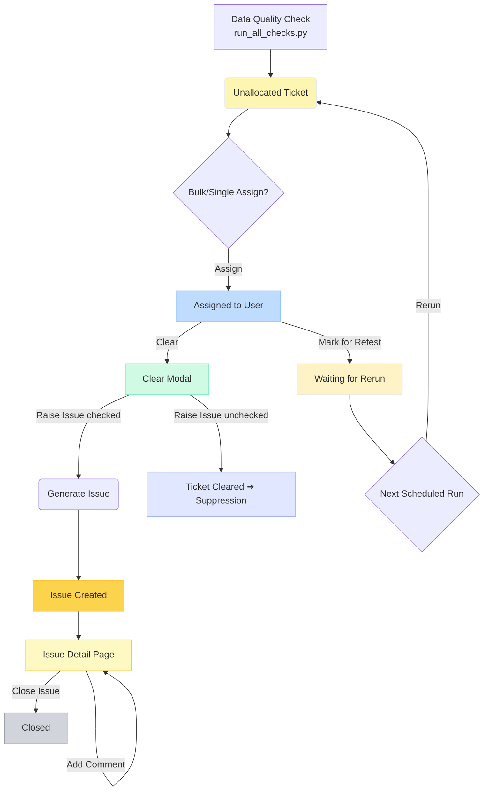

# Ticket & Issue Workflow

This document illustrates the end-to-end journey of an automatically generated data-quality ticket, from initial creation to final closure, and how it links to the Data Issues system.

Legend:

* **Unallocated Ticket** – Newly created, awaiting assignment.
* **Assigned to User** – Analyst owns the ticket.
* **Waiting for Rerun** – Ticket queued for the next data-quality run.
* **Clear Modal** – Analyst can clear the ticket and optionally raise an issue.
* **Issue Detail Page** – Supports comment timeline and status updates.

This workflow ensures transparency and preserves full audit trails from detection to remediation. 