**Important Nnte on Date Formats:**

Throughout this application, date processing logic (especially when identifying date columns in input files) should be flexible. Aim to handle common formats like `YYYY-MM-DD`, `DD/MM/YYYY`, and `YYYY-MM-DDTHH:MM:SS` where appropriate, particularly during initial data loading and column identification steps. While pre-processing steps might standardize dates to `YYYY-MM-DD`, initial parsing should be robust.

---

# Simple Data Checker

This application provides a web interface to load, process, and check financial data, primarily focusing on time-series metrics and security-level data. It helps identify potential data anomalies by calculating changes and Z-scores.

## Features

*   **Time-Series Metric Analysis:** Load `ts_*.csv` files, view latest changes, Z-scores, and historical data charts for various metrics per fund.
    *   Optionally loads corresponding `sp_ts_*.csv` files (if they exist) to provide comparison data (e.g., S&P data) on the same charts.
    *   Includes a toggle switch on the **Metric Detail Page** (`/metric/<metric_name>`) to show/hide this comparison data.
*   **Security-Level Analysis:** Load wide-format `sec_*.csv` files, view latest changes and Z-scores across securities, and drill down into historical charts (Value, Price, Duration) for individual securities.
    *   **Performance:** Uses server-side pagination, filtering (search, dropdowns), and sorting for improved performance with large datasets.
*   **Fund-Specific Views:** Analyze data aggregated or filtered by specific funds.
    *   General Fund Overview (`/fund/<fund_code>`): Displays all available time-series metric charts for a single fund.
        *   Optionally loads corresponding `sp_ts_*.csv` files for comparison data.
        *   Includes a toggle switch to show/hide this comparison data.
    *   Fund Duration Details (`/fund/duration_details/<fund_code>`): Shows duration changes for securities held by a specific fund.
*   **Security Exclusions:** Maintain a list of securities to temporarily exclude from the main Security Summary page (`/security/summary`). Exclusions can have start/end dates and comments.
*   **Data Issue Tracking:** Provides a dedicated page (`/issues`) to log, view, and manage data issues found in various sources (S&P, Production, Pi, IVP, Benchmark). Tracks who raised the issue, when, the impacted fund, the data source, the date the issue occurred, a description, and resolution details (who closed it, when, and comments). Issues are stored in `Data/data_issues.csv`.
*   **Weight Check:** Load fund (`w_Funds.csv`) and benchmark (`w_Bench.csv`) weight files and display them side-by-side, highlighting any daily weights that are not exactly 100% via `/weights/check`.
*   **Security Weight Analysis:** Load security weights (`w_secs.csv`) which use ISIN as the primary identifier, providing security-level weight information across multiple dates.
*   **Yield Curve Analysis:** Load yield curve data (`curves.csv`), check for potential inconsistencies (e.g., monotonicity, anomalous daily changes) and display curve charts per currency via `/curve/summary` and `/curve/details/<currency>`.
*   **Data Comparison:**
    *   Compare two spread files (`sec_spread.csv` vs `sec_spreadSP.csv`) via `/comparison/summary`.
    *   Compare two duration files (`sec_duration.csv` vs `sec_durationSP.csv`) via `/duration_comparison/summary`.
    *   Compare two spread duration files (`sec_Spread duration.csv` vs `sec_Spread durationSP.csv`) via `/spread_duration_comparison/summary`.
    *   All comparison pages include summary statistics and side-by-side detail charts.
    *   **Performance:** Uses server-side pagination, filtering, and sorting for summary views.
*   **Data Simulation & Management:**
    *   Simulate API calls to fetch data via the `/get_data` page.
    *   Run a data cleanup process via a button on the `/get_data` page.
*   **Handling Special Characters in IDs:** Security IDs can contain special characters, including slashes (`/`, `\\`), spaces, and symbols (`#`). The application uses the `urlencode` filter in templates to create safe URLs and the `<path:security_id>` converter in Flask routes to capture these IDs correctly. **Note:** Inside view functions receiving such IDs, especially when comparing against data (e.g., filtering a DataFrame), it may be necessary to explicitly decode the `security_id` variable using `urllib.parse.unquote(security_id)` to ensure it matches the format stored in the data source.

## File Structure Overview

```mermaid
graph TD
    A[Simple Data Checker] --> B(app.py);
    A --> C{Python Modules};
    A --> D{Views};
    A --> E{Templates};
    A --> F{Static Files};
    A --> G(Data);
    A --> H(Config/Utils);

    C --> C1(data_loader.py);
    C --> C2(metric_calculator.py);
    C --> C3(security_processing.py);
    C --> C4(process_data.py);
    C --> C5(curve_processing.py);
    C --> C6(issue_processing.py);

    D --> D1(main_views.py);
    D --> D2(metric_views.py);
    D --> D3(security_views.py);
    D --> D4(fund_views.py);
    D --> D5(exclusion_views.py);
    D --> D6(comparison_views.py);
    D --> D7(weight_views.py);
    D --> D8(api_views.py);
    D --> D9(duration_comparison_views.py);
    D --> D10(spread_duration_comparison_views.py);
    D --> D11(curve_views.py);
    D --> D12(issue_views.py);

    E --> E1(base.html);
    E --> E2(index.html);
    E --> E3(metric_page_js.html);
    E --> E4(securities_page.html);
    E --> E5(security_details_page.html);
    E --> E6(fund_duration_details.html);
    E --> E7(exclusions_page.html);
    E --> E8(get_data.html);
    E --> E9(comparison_page.html);
    E --> E10(comparison_details_page.html);
    E --> E11(fund_detail_page.html);
    E --> E12(weight_check.html);
    E --> E13(duration_comparison_page.html);
    E --> E14(duration_comparison_details_page.html);
    E --> E15(spread_duration_comparison_page.html);
    E --> E16(spread_duration_comparison_details_page.html);
    E --> E17(curve_summary.html);
    E --> E18(curve_details.html);
    E --> E19(issues_page.html);

    F --> F1(js);
    F1 --> F1a(main.js);
    F1 --> F1b(modules);
    F1b --> F1b1(ui);
    F1b1 --> F1b1a(chartRenderer.js);
    F1b1 --> F1b1b(securityTableFilter.js);
    F1b1 --> F1b1c(tableSorter.js);
    F1b1 --> F1b1d(toggleSwitchHandler.js);
    F1b --> F1b2(utils);
    F1b2 --> F1b2a(helpers.js);
    F1b --> F1b3(charts);
    F1b3 --> F1b3a(timeSeriesChart.js);

    G --> G1(ts_*.csv);
    G --> G2(sec_*.csv);
    G --> G3(pre_*.csv);
    G --> G4(new_*.csv);
    G --> G5(exclusions.csv);
    G --> G6(QueryMap.csv);
    G --> G7(FundList.csv);
    G --> G8(w_Funds.csv);
    G --> G9(w_Bench.csv);
    G --> G10(curves.csv);
    G --> G11(data_issues.csv);
    G --> G12(w_secs.csv);

    H --> H1(config.py);
    H --> H2(utils.py);

    B --> D;
    D --> C;
    D --> H;
    D --> E;
    E --> F;
```

## Data Files (`Data/`)

*   `ts_*.csv`: Time-series data, indexed by Date and Code (Fund/Benchmark).
*   `sp_ts_*.csv`: (Optional) Secondary/comparison time-series data, corresponding to `ts_*.csv` files. Used on Metric and Fund Detail pages.
*   `sec_*.csv`: Security-level data, typically wide format with dates as columns.
*   `pre_*.csv`: Input files for the `process_data.py` script. This script processes these files and saves the output as `sec_*.csv`, overwriting any existing files with the same name.
*   `new_*.csv`: Output files from the `process_data.py` script.
*   **`exclusions.csv`**: Stores the list of excluded securities. Contains columns: `SecurityID`, `AddDate`, `EndDate`, `Comment`.
*   `QueryMap.csv`: Maps query IDs to filenames for the API simulation.
*   `FundList.csv`: Contains fund codes and metadata used on the API simulation page.
*   `Dates.csv`: May exist for specific configurations or helper data.
*   `w_Funds.csv`: Wide format file containing daily fund weights (expected to be 100%). Used by the Weight Check page.
*   `w_Bench.csv`: Wide format file containing daily benchmark weights (expected to be 100%). Used by the Weight Check page.
*   `w_secs.csv`: Wide format file containing security weights across multiple dates. Uses ISIN as the primary identifier column, along with other security attributes like Security Name, Funds, Type, etc. This file provides the security weight data referenced in various parts of the application, particularly for security-level analysis.
*   `curves.csv`: Contains yield curve data (Date, Currency Code, Term, Daily Value). Used by the Yield Curve Check feature.
*   **`data_issues.csv`**: Stores a log of reported data issues. Columns: `IssueID`, `DateRaised`, `RaisedBy`, `FundImpacted`, `DataSource`, `IssueDate`, `Description`, `Status` ('Open'/'Closed'), `DateClosed`, `ClosedBy`, `ResolutionComment`.

## Python Files

### `app.py`
*   **Purpose:** Defines the main entry point and structure for the Simple Data Checker Flask web application. It utilizes the Application Factory pattern (`create_app`) to initialize and configure the Flask app.
*   **Key Responsibilities:**
    *   Creating the Flask application instance.
    *   Setting up basic configuration (like the secret key).
    *   Ensuring necessary folders (like the instance folder) exist.
    *   Registering all Blueprints (e.g., `main_bp`, `metric_bp`, `security_bp`, `fund_bp`, `exclusion_bp`, `comparison_bp`, `duration_comparison_bp`, `spread_duration_comparison_bp`, `api_bp`, `weight_bp`) from the `views` directory.
    *   Includes an endpoint (`/run-cleanup`) to trigger the `process_data.py` script.
    *   Providing a conditional block (`if __name__ == '__main__':`) to run the development server.
*   **Functions:**
    *   `create_app()`: Factory function to create and configure the Flask app.
    *   `run_cleanup()`: Endpoint to run the cleanup script.
    *   `hello()`: Simple test route (can be removed).

### `config.py`
*   **Purpose:** Defines configuration variables for the Simple Data Checker application.
*   **Variables:**
    *   `DATA_FOLDER`: Specifies the directory containing data files.
    *   `COLOR_PALETTE`: Defines a list of colors for chart lines.

### `data_loader.py`
*   **Purpose:** Responsible for loading and preprocessing data from time-series CSV files (`ts_*.csv`).
*   **Key Features:**
    *   Dynamically identifies 'Date' (using `Date` or `Position Date`), 'Code', and optional benchmark columns (using `Bench`).
    *   Parses dates using pandas `to_datetime` (handles various formats).
    *   Standardizes key column names (`Date`, `Code`, `Benchmark`).
    *   Sets a MultiIndex (`Date`, `Code`).
    *   Converts value columns to numeric using `pd.to_numeric(errors='coerce')`.
    *   Logs progress and errors to `data_processing_errors.log`.
*   **Functions:**
    *   `_find_column(...)`: Helper to find columns by regex.
    *   `load_and_process_data(...)`: Main function for loading and processing.

### `metric_calculator.py`
*   **Purpose:** Provides functions for calculating statistical metrics (mean, max, min, latest value, change, Z-score) from preprocessed time-series data.
*   **Key Features:**
    *   Operates on DataFrames indexed by Date and Fund Code.
    *   Calculates metrics for primary data (e.g., `ts_*.csv`) and optionally for secondary/comparison data (e.g., `sp_ts_*.csv`).
    *   Handles fund and benchmark columns for both primary and secondary sources.
    *   Handles `NaN` values gracefully.
*   **Functions:**
    *   `_calculate_column_stats(...)`: Helper for single-column stats.
    *   `calculate_latest_metrics(...)`: Calculates latest metrics per fund for both primary and secondary data, sorted by max absolute primary Z-score.

### `process_data.py`
*   **Purpose:** Serves as a pre-processing step for specific CSV files (usually `pre_*.csv`), aggregating rows and handling duplicates. It outputs corresponding `sec_*.csv` files, overwriting existing ones.
*   **Functions:**
    *   `process_csv_file(...)`: Processes a single input file.
    *   `main()`: Processes all `pre_*.csv` files in the `Data` directory.

### `security_processing.py`
*   **Purpose:** Handles loading, processing, and analysis of security-level data (usually `sec_*.csv`).
*   **Key Features:**
    *   Assumes wide format (dates as columns).
    *   Dynamically identifies ID, static, and date columns (using `utils._is_date_like`).
    *   Melts data into long format (Date, Security ID).
    *   Robust type conversion (`pd.to_datetime`, `pd.to_numeric`, `errors='coerce'`).
    *   Calculates latest metrics (Latest Value, Change, Mean, Max, Min, Change Z-Score) per security.
*   **Functions:**
    *   `_is_date_like(...)`: Moved to `utils.py`.
    *   `load_and_process_security_data(...)`: Loads and melts wide-format data.
    *   `calculate_security_latest_metrics(...)`: Calculates metrics on long-format data.

### `utils.py`
*   **Purpose:** Contains common utility functions.
*   **Functions:**
    *   `_is_date_like(column_name)`: Checks if a column name resembles `YYYY-MM-DD` or `DD/MM/YYYY` format.
    *   `parse_fund_list(fund_string)`: Parses a string like `'[FUND1,FUND2]'` into a list.

### `curve_processing.py`
*   **Purpose:** Handles loading, preprocessing, and analysis of yield curve data (`Data/curves.csv`).
*   **Key Features:**
    *   Loads data, parses dates.
    *   Converts term strings (e.g., '7D', '1M') into an approximate number of days (`TermDays`) for plotting and sorting.
    *   Checks for basic curve inconsistencies on the latest date:
        *   Monotonicity check (identifies significant downward slopes).
        *   Compares the shape of the daily change profile against the previous day to find anomalous jumps for specific terms.
*   **Functions:**
    *   `_term_to_days(...)`: Converts term string to days.
    *   `load_curve_data(...)`: Loads and preprocesses the `curves.csv` file.
    *   `get_latest_curve_date(...)`: Finds the most recent date in the loaded data.
    *   `check_curve_inconsistencies(...)`: Performs the inconsistency checks and returns a summary dictionary.

### `issue_processing.py`
*   **Purpose:** Handles loading, adding, and updating data issues stored in `Data/data_issues.csv`.
*   **Key Features:**
    *   Loads the CSV into a DataFrame, parsing dates.
    *   Generates unique, sequential IDs (e.g., `ISSUE-001`) for new issues.
    *   Provides functions to add a new issue (`add_issue`) and close an existing one (`close_issue`).
    *   Loads the list of available funds from `Data/FundList.csv` for use in dropdowns.
    *   Ensures the `data_issues.csv` file exists with correct headers.
*   **Functions:**
    *   `load_issues()`: Loads issues from CSV.
    *   `_save_issues()`: Saves DataFrame to CSV.
    *   `_generate_issue_id()`: Creates a new issue ID.
    *   `add_issue()`: Adds a new record.
    *   `close_issue()`: Updates a record to 'Closed' status with resolution details.
    *   `load_fund_list()`: Gets fund codes from `FundList.csv`.

## View Modules (`views/`)

These modules contain the Flask Blueprints defining the application's routes.

### `views/main_views.py` (`main_bp`)
*   **Purpose:** Main dashboard/index page.
*   **Routes:**
    *   `/`: Renders `index.html`, showing links to metric pages and a summary table of latest Z-Scores across all metrics and funds. Fund codes link to the general fund detail page (`/fund/<fund_code>`).

### `views/metric_views.py` (`metric_bp`)
*   **Purpose:** Detailed views for specific time-series metrics.
*   **Routes:**
    *   `/metric/<metric_name>`: Renders `metric_page_js.html`. Loads primary (`ts_*.csv`) and optional secondary (`sp_ts_*.csv`) data. Calculates metrics for both, prepares JSON data (including an `isSpData` flag in datasets), and passes it to the template. The JavaScript (`main.js`, `chartRenderer.js`) renders charts and handles the SP data toggle switch.

### `views/security_views.py` (`security_bp`)
*   **Purpose:** Security-level data checks.
*   **Routes:**
    *   `/security/summary`: Renders `securities_page.html`.
        *   **Handles server-side pagination, filtering (search, static columns), and sorting.**
        *   Loads spread data (`sec_Spread.csv`), applies filters/search/exclusions.
        *   Calculates metrics, sorts data, and selects the current page.
        *   Passes paginated data and metadata to the template.
        *   Security IDs (using ISIN from `w_secs.csv`) link to the details page.
    *   `/security/details/<metric_name>/<path:security_id>`: Renders `security_details_page.html`.
        *   Shows historical charts for a specific security. The `security_id` from the URL (which is typically an ISIN) is decoded using `urllib.parse.unquote`.
        *   **Data Loading:** Filters data primarily using the decoded `security_id` against the `ISIN` column/index in the relevant `sec_*.csv` files. If no data is found using `ISIN`, it attempts a fallback filter using the `Security Name` column.
        *   Displays the requested base `metric_name` overlaid with Price (from `sec_Price.csv`).
        *   Additionally displays separate charts for:
            *   Duration (from `sec_Duration.csv`) overlaid with SP Duration (from `sec_DurationSP.csv`).
            *   Spread Duration (from `sec_Spread duration.csv`) overlaid with SP Spread Duration (from `sec_Spread durationSP.csv`).
            *   Spread (from `sec_Spread.csv`) overlaid with SP Spread (from `sec_SpreadSP.csv`).
        *   SP data files are loaded if they exist.

### `views/fund_views.py` (`fund_bp`)
*   **Purpose:** Fund-specific views.
*   **Routes:**
    *   `/fund/duration_details/<fund_code>`: Renders `fund_duration_details.html`. Loads `sec_duration.csv`, filters by fund, calculates recent duration changes, and displays results.
    *   `/fund/<fund_code>`: Renders `fund_detail_page.html`. Finds all primary `ts_*.csv` files and corresponding optional `sp_ts_*.csv` files. Loads data for the specified fund from both sources, adds an `isSpData` flag to datasets, and prepares data for rendering multiple time-series charts on a single page via JavaScript (`main.js`, `chartRenderer.js`), including an SP data toggle switch.

### `views/exclusion_views.py` (`exclusion_bp`)
*   **Purpose:** Managing the security exclusion list (`Data/exclusions.csv`).
*   **Routes:**
    *   `/exclusions` (GET/POST): Renders `exclusions_page.html` to view/add exclusions.
    *   `/exclusions/remove` (POST): Removes an exclusion.

### `views/comparison_views.py` (`comparison_bp`)
*   **Purpose:** Comparing two spread files (`sec_spread.csv` vs. `sec_spreadSP.csv`).
*   **Routes:**
    *   `/comparison/summary`: Renders `comparison_page.html`.
        *   **Handles server-side pagination, filtering (static columns), and sorting.**
        *   Loads both files, calculates comparison statistics (correlation, diffs, date ranges).
        *   Applies filters, sorts data, and selects the current page.
        *   Passes paginated data and metadata to the template.
        *   Uses the `id_column_name` variable to determine which column serves as the security identifier (typically ISIN).
    *   `/comparison/details/<path:security_id>`: Renders `comparison_details_page.html`. Shows side-by-side historical charts for a specific security.

### `views/duration_comparison_views.py` (`duration_comparison_bp`)
*   **Purpose:** Comparing two duration files (`sec_duration.csv` vs. `sec_durationSP.csv`).
*   **Routes:**
    *   `/duration_comparison/summary`: Renders `duration_comparison_page.html`.
        *   Handles server-side pagination, filtering (static columns), and sorting.
        *   Loads both files, calculates comparison statistics.
        *   Applies filters, sorts data, and selects the current page.
        *   Passes paginated data and metadata to the template.
        *   Uses the `id_column_name` variable to determine which column serves as the security identifier (typically ISIN).
    *   `/duration_comparison/details/<path:security_id>`: Renders `duration_comparison_details_page.html`. Shows side-by-side historical charts for a specific security.

### `views/spread_duration_comparison_views.py` (`spread_duration_comparison_bp`)
*   **Purpose:** Comparing two spread duration files (`sec_Spread duration.csv` vs. `sec_Spread durationSP.csv`).
*   **Routes:**
    *   `/spread_duration_comparison/summary`: Renders `spread_duration_comparison_page.html`.
        *   Handles server-side pagination, filtering (static columns), and sorting.
        *   Loads both files, calculates comparison statistics.
        *   Applies filters, sorts data, and selects the current page.
        *   Passes paginated data and metadata to the template.
        *   Uses the `id_column_name` variable to determine which column serves as the security identifier (typically ISIN).
    *   `/spread_duration_comparison/details/<path:security_id>`: Renders `spread_duration_comparison_details_page.html`. Shows side-by-side historical charts for a specific security.

### `views/api_views.py` (`api_bp`)
*   **Purpose:** Handling the API simulation page interactions.
*   **Routes:**
    *   `/get_data`: Renders `get_data.html` (GET). Shows data file statuses, fund selection, and date inputs.
    *   `/run-api-calls`: Handles the POST request from `get_data.html` to simulate API calls based on `QueryMap.csv`. Reads data, merges/overwrites based on `overwrite_mode` flag, and saves to `Data/` folder.
    *   `/rerun-api-call`: Handles POST requests to rerun a single API call for a specific fund.
*   **Key Features:**
    *   Dynamic column detection looks for identifiers like 'Code', 'Fund Code', 'security id', 'SecurityID', 'Security Name'.
    *   When processing security-related files (like `w_secs.csv`), the system will look for ISIN in these column candidates.
    *   Provides file status checking and robust handling of various file formats.

### `views/weight_views.py` (`weight_bp`)
*   **Purpose:** Handles the weight checking functionality.
*   **Routes:**
    *   `/weights/check`: Renders `weight_check_page.html`. Loads data from `w_Funds.csv` and `w_Bench.csv`, processes percentage values, checks if they equal 100%, and passes the processed data to the template for display.

### `views/curve_views.py` (`curve_bp`)
*   **Purpose:** Handles the yield curve checking views.
*   **Routes:**
    *   `/curve/summary`: Renders `curve_summary.html`. Loads curve data, runs inconsistency checks using `curve_processing.check_curve_inconsistencies`, and displays a summary table for all currencies.
    *   `/curve/details/<currency>`: Renders `curve_details.html`. Displays a line chart of the yield curve for the specified `currency` on a selected date. Includes a dropdown to select and view curves for previous dates.

### `views/issue_views.py` (`issue_bp`)
*   **Purpose:** Handles the Data Issue Tracking page.
*   **Routes:**
    *   `/issues` (GET/POST): Renders `issues_page.html`. Displays separate tables for open and closed issues. Handles the form submission for adding a new issue.
    *   `/issues/close` (POST): Handles the form submission (via modal) to mark an issue as closed, recording the closer and resolution comment.

## HTML Templates (`templates/`)

*   **`base.html`:** Main layout, includes Bootstrap, navbar, common structure. All other templates extend this.
*   **`index.html`:** Dashboard page. Displays metric links and Z-Score summary table.
*   **`metric_page_js.html`:** Detail page for a time-series metric (rendered via JS).
    *   Includes a toggle switch (`#toggleSpData`) to show/hide secondary/SP comparison data on charts.
*   **`securities_page.html`:** Security check summary table. Includes filter/search form, sortable headers, table body, and pagination controls.
*   **`security_details_page.html`:** Detail page for a single security (charts).
*   **`fund_duration_details.html`:** Table showing security duration changes for a specific fund.
*   **`exclusions_page.html`:** UI for managing security exclusions.
*   **`get_data.html`:** UI for API simulation. Includes data status table, fund selection, date inputs, status/results area, and buttons for simulation, overwrite, and cleanup.
*   **`comparison_page.html`:** Comparison summary table. Includes filter form, sortable headers, table body, and pagination controls.
*   **`comparison_details_page.html`:** Side-by-side chart comparison for a single security (Spread).
*   **`fund_detail_page.html`:** Displays multiple charts for different metrics for a single fund.
    *   Includes a toggle switch (`#toggleSpData`) to show/hide secondary/SP comparison data on charts.
*   **`weight_check.html`:** Placeholder page for weight checks.
*   **`duration_comparison_page.html`:** Comparison summary table for Duration.
*   **`duration_comparison_details_page.html`:** Side-by-side chart comparison for a single security (Duration).
*   **`spread_duration_comparison_page.html`:** Comparison summary table for Spread Duration.
*   **`spread_duration_comparison_details_page.html`:** Side-by-side chart comparison for a single security (Spread Duration).
*   **`curve_summary.html`:** Displays a summary table of the yield curve inconsistency checks for the latest date across all currencies.
*   **`curve_details.html`:** Shows a line chart of the yield curve for a specific currency and provides a date selector to view historical curves. Includes JavaScript for Chart.js rendering.
*   **`issues_page.html`:** UI for tracking data issues. Includes a form to raise new issues and tables to display open and closed issues, with functionality to close open ones via a modal.