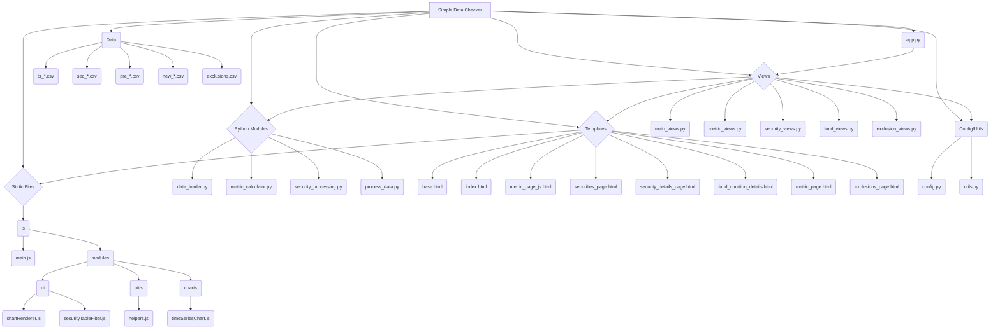

# Simple Data Checker

This application provides a web interface to load, process, and check financial data, primarily focusing on time-series metrics and security-level data. It helps identify potential data anomalies by calculating changes and Z-scores.

## Features

*   **Time-Series Metric Analysis:** Load `ts_*.csv` files, view latest changes, Z-scores, and historical data charts for various metrics per fund.
*   **Security-Level Analysis:** Load wide-format `sec_*.csv` files, view latest changes and Z-scores across securities, and drill down into historical charts (Value, Price, Duration) for individual securities.
*   **Fund-Specific Views:** Analyze data aggregated or filtered by specific funds (e.g., Fund Duration Details).
*   **Security Exclusions:** Maintain a list of securities to temporarily exclude from the main Security Summary page (`/security/summary`). Exclusions can have start/end dates and comments.

## File Structure Overview



## Data Files (`Data/`)

*   `ts_*.csv`: Time-series data, indexed by Date and Code (Fund/Benchmark).
*   `sec_*.csv`: Security-level data, typically wide format with dates as columns.
*   `pre_*.csv`: Input files for the `process_data.py` script.
*   `new_*.csv`: Output files from the `process_data.py` script.
*   **`exclusions.csv`**: Stores the list of excluded securities. Contains columns: `SecurityID`, `AddDate`, `EndDate`, `Comment`.
*   Other files like `QueryMap.csv`, `FundList.csv`, `Dates.csv` may exist for specific configurations or helper data.

## Python Files

### `app.py`
*   **Purpose:** Defines the main entry point and structure for the Simple Data Checker Flask web application. It utilizes the Application Factory pattern (`create_app`) to initialize and configure the Flask app.
*   **Key Responsibilities:**
    *   Creating the Flask application instance.
    *   Setting up basic configuration (like the secret key).
    *   Ensuring necessary folders (like the instance folder) exist.
    *   Registering Blueprints (`main_bp`, `metric_bp`, `security_bp`, `fund_bp`, `exclusion_bp`) from the `views` directory, which contain the application's routes and view logic.
    *   Providing a conditional block (`if __name__ == '__main__':`) to run the development server when the script is executed directly.
*   **Functions:**
    *   `create_app()`: Factory function to create and configure the Flask app.
    *   `hello()`: Simple test route (can be removed).

### `config.py`
*   **Purpose:** Defines configuration variables for the Simple Data Checker application. It centralizes settings like file paths and visual parameters (e.g., chart colors) to make them easily adjustable without modifying the core application code.
*   **Variables:**
    *   `DATA_FOLDER`: Specifies the directory containing data files.
    *   `COLOR_PALETTE`: Defines a list of colors for chart lines.

### `data_loader.py`
*   **Purpose:** Responsible for loading and preprocessing data from time-series CSV files (typically prefixed with `ts_`). It includes functions to dynamically identify essential columns (Date, Code, Benchmark) based on patterns, handle potential naming variations, parse dates (expecting 'YYYY-MM-DD' format in the 'Date' column), standardize column names, set appropriate data types, and prepare the data in a pandas DataFrame format suitable for further analysis.
*   **Robustness Features:**
    *   Uses Python's `logging` module to report progress and errors. Warnings and errors are logged to `data_processing_errors.log` in the project root.
    *   Handles file not found errors gracefully.
    *   Uses `on_bad_lines='skip'` and `encoding_errors='replace'` when reading CSVs to handle malformed rows and encoding issues.
    *   Performs data type conversion for value columns using `pd.to_numeric` with `errors='coerce'`, converting unparseable values to `NaN`. Logs a warning if all values in a column become `NaN`. Replaces `NaN`/`Inf` with `None` for JSON compatibility where needed.
    *   Dynamically finds required columns ('Date', 'Code') and optionally 'Benchmark', raising errors if they cannot be uniquely identified.
    *   **Handles both `YYYY-MM-DD` and `DD/MM/YYYY` date formats when parsing the date column.**
*   **Functions:**
    *   `_find_column(pattern, columns, filename, col_type)`: Helper to find a single column matching a regex pattern (case-insensitive).
    *   `load_and_process_data(filename, data_folder)`: Loads a CSV, identifies key columns dynamically, renames them, parses dates (handling both common formats), sets a MultiIndex (Date, Code), identifies original fund column names, ensures numeric types, handles NaN/Inf, and logs issues encountered.

### `metric_calculator.py`
*   **Purpose:** Provides functions for calculating various statistical metrics from the preprocessed time-series data. Key functionalities include calculating historical statistics (mean, max, min), latest values, period-over-period changes, and Z-scores for changes for both benchmark and fund columns. It operates on a pandas DataFrame indexed by Date and Fund Code.
*   **Robustness Features:**
    *   Uses the shared `logging` module (`data_processing_errors.log`).
    *   Handles empty or incorrectly indexed input DataFrames gracefully.
    *   Safely calculates statistics (mean, max, min, std) by implicitly or explicitly handling `NaN` values.
    *   Handles potential `NaN` or `inf` results during Z-score calculation (e.g., due to missing data or zero standard deviation).
    *   Checks for the existence of expected columns (benchmark, funds) and skips calculations with a warning if columns are missing.
    *   Handles cases where a specific fund or the latest date might be missing for a given column.
*   **Functions:**
    *   `_calculate_column_stats(col_series, col_change_series, latest_date, col_name)`: Helper to calculate stats (mean, max, min, latest value, latest change, change Z-score) for a single column series, handling potential `NaN`s.
    *   `calculate_latest_metrics(df, fund_cols, benchmark_col)`: Calculates the latest metrics for each individual column (benchmark and funds) per fund code, returning a summary DataFrame sorted by the maximum absolute 'Change Z-Score' found across all columns for each fund.

### `process_data.py`
*   **Purpose:** Serves as a pre-processing step for specific CSV files within the `Data` directory, typically targeting files prefixed with `pre_`. It reads these files, aggregates rows based on identical values across most columns (excluding 'Funds' and 'Security Name'), handles duplicate 'Security Name' entries by suffixing them, aggregates associated 'Funds' into a list-like string, and saves the processed data to a new CSV file prefixed with `new_`. This is often used for preparing security attribute files.
*   **Robustness Features:**
    *   Uses the shared `logging` module (`data_processing_errors.log`).
    *   Reads input CSVs using `on_bad_lines='skip'` and encoding error handling.
    *   Checks for required columns ('Funds', 'Security Name') and skips files if missing.
    *   Handles empty or invalid input files.
    *   Uses `dropna=False` and explicit type conversions during grouping to handle potential `NaN` values and diverse data types in grouping keys ('Security Name', `id_cols`).
    *   Safely aggregates 'Funds', handling potential `NaN`s.
    *   Catches errors during file processing and grouping, logging issues and attempting to continue where possible.
    *   Logs a summary of files processed/skipped in the `main` function.
*   **Functions:**
    *   `process_csv_file(input_path, output_path)`: Reads a `pre_*.csv` file, performs the aggregation and renaming logic, handles errors, and writes to a `new_*.csv` file.
    *   `main()`: Finds and processes all `pre_*.csv` files in the `Data` directory when the script is run directly, logging a summary.

### `security_processing.py`
*   **Purpose:** Handles the loading, processing, and analysis of security-level data, assuming input CSV files are structured with one security per row and time-series data spread across columns where headers represent dates (e.g., YYYY-MM-DD).
*   **Robustness Features:**
    *   Uses the shared `logging` module (`data_processing_errors.log`).
    *   Reads input CSVs using `on_bad_lines='skip'` and encoding error handling.
    *   Dynamically identifies ID, static, and date columns; handles files missing date columns or ID columns by logging an error and returning an empty DataFrame.
    *   Uses `errors='coerce'` for date parsing (`pd.to_datetime`) and value conversion (`pd.to_numeric`), turning errors into `NaT`/`NaN`.
    *   Drops rows with conversion errors or missing IDs after melting, logging a warning about dropped rows.
    *   Handles empty DataFrames after processing steps.
    *   Metric calculation (`calculate_security_latest_metrics`) handles `NaN`s gracefully in stats (mean, max, min, std, diff) and Z-score calculations, including zero standard deviation cases.
    *   Checks for missing 'Value' column or incorrect index structure before metric calculation.
*   **Functions:**
    *   `_is_date_like(column_name)`: Checks if a column name resembles a date format (more flexible matching).
    *   `load_and_process_security_data(filename)`: Reads a wide-format security CSV, identifies ID, static, and date columns, 'melts' the data into a long format (Date, Security ID), converts types robustly, handles errors, and returns the processed DataFrame and static column names.
    *   `calculate_security_latest_metrics(df, static_cols)`: Takes the long-format security DataFrame and calculates metrics (Latest Value, Change, Mean, Max, Min, Change Z-Score) for each security's 'Value' over time, preserving static attributes and handling potential data issues.

### `utils.py`
*   **Purpose:** Contains utility functions used throughout the application, providing common helper functionalities like parsing specific string formats or validating data types.
*   **Functions:**
    *   `parse_fund_list(fund_string)`: Parses a string like `'[FUND1,FUND2]'` into a list of strings.

## View Modules (`views/`)

These modules contain the Flask Blueprints that define the application's routes and logic for handling web requests and rendering templates.

```mermaid
graph LR
    subgraph Flask App (app.py)
        direction LR
        FApp[Flask Instance]
    end

    subgraph Blueprints
        direction TB
        BP_Main[main_bp]
        BP_Metric[metric_bp]
        BP_Security[security_bp]
        BP_Fund[fund_bp]
        BP_Exclusion[exclusion_bp]
    end

    subgraph Routes
        direction TB
        R_Index[/] --> BP_Main;
        R_Metric[/metric/<metric_name>] --> BP_Metric;
        R_Securities[/security/summary] --> BP_Security;
        R_SecDetails[/security/details/<metric_name>/<security_id>] --> BP_Security;
        R_FundDetails[/fund_duration_details/<fund_code>] --> BP_Fund;
        R_Exclusions[/exclusions] --> BP_Exclusion;
        R_RemoveExclusion[/exclusions/remove] --> BP_Exclusion;
    end

    subgraph Templates
        direction TB
        T_Index[index.html]
        T_MetricJS[metric_page_js.html]
        T_Securities[securities_page.html]
        T_SecDetails[security_details_page.html]
        T_FundDetails[fund_duration_details.html]
        T_Exclusions[exclusions_page.html]
    end
    
    subgraph Data Processing
        direction TB
        DP_Loader[data_loader.py]
        DP_MetricCalc[metric_calculator.py]
        DP_SecProc[security_processing.py]
        DP_ExclView[exclusion_views.py]
        DP_Utils[utils.py]
        Data_Excl[exclusions.csv]
    end

    FApp -- registers --> BP_Main;
    FApp -- registers --> BP_Metric;
    FApp -- registers --> BP_Security;
    FApp -- registers --> BP_Fund;
    FApp -- registers --> BP_Exclusion;

    BP_Main -- uses --> DP_Loader;
    BP_Main -- uses --> DP_MetricCalc;
    BP_Main -- renders --> T_Index;

    BP_Metric -- uses --> DP_Loader;
    BP_Metric -- uses --> DP_MetricCalc;
    BP_Metric -- uses --> DP_Utils;
    BP_Metric -- renders --> T_MetricJS;
    
    BP_Security -- uses --> DP_SecProc;
    BP_Security -- uses --> DP_ExclView;
    BP_Security -- uses --> DP_Utils;
    BP_Security -- renders --> T_Securities;
    BP_Security -- renders --> T_SecDetails;

    BP_Fund -- uses --> DP_SecProc;
    BP_Fund -- uses --> DP_Utils;
    BP_Fund -- renders --> T_FundDetails;

    BP_Exclusion -- uses --> DP_ExclView;
    DP_ExclView -- reads/writes --> Data_Excl;
    BP_Exclusion -- renders --> T_Exclusions;

    T_Securities -- links to --> R_Exclusions;

```

### `views/main_views.py` (`main_bp`)
*   **Purpose:** Defines routes for the main, top-level views, primarily the dashboard/index page.
*   **Routes:**
    *   `/`: Renders `index.html`. Scans for `ts_*.csv` files, calculates Z-score summaries across all metrics and funds, and displays them in a table. Also provides links to individual metric pages.

### `views/metric_views.py` (`metric_bp`)
*   **Purpose:** Defines routes for displaying detailed views of specific time-series metrics (e.g., Yield, Duration).
*   **Routes:**
    *   `/metric/<metric_name>`: Renders `metric_page_js.html`. Takes a metric display name, loads the corresponding `ts_*.csv` file, calculates metrics for each fund, prepares data (including historical values) for charting, and passes it as a **structured JSON payload** to the template for JavaScript rendering. The JSON includes a `metadata` key (metric name, latest date, column names) and a `funds` key (fund-specific data: labels, datasets, calculated metrics). Replaces NaN/Inf with `None` in the JSON data.

### `views/security_views.py` (`security_bp`)
*   **Purpose:** Defines routes related to displaying security-level data checks.
*   **Routes:**
    *   `/security/summary`: Renders `securities_page.html`. 
        *   Accepts an optional `search_term` query parameter for filtering by security name (case-insensitive contains search).
        *   Loads data processed by `security_processing.py` (currently from `sec_Spread.csv`).
        *   Applies the `search_term` filter if provided.
        *   Loads the active exclusions from `Data/exclusions.csv` via `exclusion_views.py` and filters out excluded securities.
        *   Calculates latest metrics for each remaining security.
        *   Provides filter options based on static columns.
        *   Displays the results in a filterable table, sorted by absolute 'Change Z-Score'.
        *   Rows are highlighted based on 'Change Z-Score'.
        *   Security IDs link to the details page.
        *   A button links to the 'Manage Exclusions' page.
    *   `/security/details/<metric_name>/<security_id>`: Renders `security_details_page.html`. Loads historical data for a specific security and metric (and potentially related metrics like Price and Duration), prepares chart data, and passes it to the template for JavaScript rendering of time-series charts.

### `views/fund_views.py` (`fund_bp`)
*   **Purpose:** Defines routes for displaying fund-specific details, currently focused on duration changes.
*   **Routes:**
    *   `/fund_duration_details/<fund_code>`: Renders `fund_duration_details.html`. Loads security duration data (likely from `new_sec_duration.csv`), filters it for the specified `fund_code`, calculates recent duration changes for each security held by the fund, and displays the results sorted by the largest change. Security names link to their respective detail pages.

### `views/exclusion_views.py` (`exclusion_bp`)
*   **Purpose:** Defines routes for managing the security exclusion list.
*   **Routes:**
    *   `/exclusions` (GET): Renders `exclusions_page.html`. Loads the current list from `Data/exclusions.csv` and loads available securities (from `Data/sec_spread.csv`'s 'Security Name' column) for the add form dropdown.
    *   `/exclusions` (POST): Processes the form submission to add a new exclusion entry to `Data/exclusions.csv`. Requires Security Name and Comment; End Date is optional.
    *   `/exclusions/remove` (POST): Processes requests to remove an exclusion entry from `Data/exclusions.csv` based on SecurityID and AddDate.

## HTML Templates (`templates/`)

These files define the structure and presentation of the web pages using HTML and Jinja2 templating.

*   **`base.html`:** The main layout template. Includes the common structure (doctype, head, Bootstrap CSS/JS, navbar, main content block, script block). Other templates extend this base. Linked JS: `static/js/main.js`.
*   **`index.html`:** The dashboard page. Extends `base.html`. Displays links to metric detail pages and a summary table of the latest 'Change Z-Scores' across all funds and time-series metrics. Includes links to the Securities Check page and the Get Data API simulation page.
*   **`metric_page_js.html`:** The detail page for a specific time-series metric. Extends `base.html`. Displays the metric name, latest date, and warnings for missing data. Contains a `<script id="chartData">` tag where Flask embeds JSON data. An empty `<div id="chartsArea">` serves as the container where `main.js` (via `chartRenderer.js`) dynamically renders tables and charts for each fund code. Requires `Chart.js`.
*   **`securities_page.html`:** Displays the table of security-level checks. Extends `base.html`. 
    *   Includes a search bar to filter securities by name (submits via GET).
    *   Includes filter dropdowns for static columns (powered by `securityTableFilter.js`).
    *   Contains the main table (`<table id="securities-table">`) populated with data from the `security_bp` view.
    *   Rows are styled based on Z-scores, and security IDs link to the details page.
*   **`security_details_page.html`:** Shows details for a single security. Extends `base.html`. Displays static info and provides canvas elements (`<canvas id="primarySecurityChart">`, `<canvas id="durationSecurityChart">`) and embedded JSON data (`<script id="chartJsonData">`) for JavaScript to render time-series charts (metric value, price, duration). Uses Jinja2's `|tojson` filter to safely embed Flask variables (like `metric_name` and the main `chart_data_json`) into the JavaScript/JSON context, preventing errors from special characters. Requires `Chart.js`.
*   **`fund_duration_details.html`:** Shows the security duration changes for a specific fund. Extends `base.html`. Displays a table (`<table id="fund-duration-table">`) listing securities held by the fund, sorted by their 1-day duration change. Security names link to their detail pages.
*   **`metric_page.html`:** (Potentially older/alternative version) Similar to `metric_page_js.html` but seems designed for server-side rendering of charts (e.g., using a library like `mpld3` or passing chart HTML directly) rather than client-side rendering with JavaScript.
*   **`exclusions_page.html`**: The UI for managing security exclusions. Extends `base.html`. Displays the current list of exclusions with their details (SecurityID, AddDate, EndDate, Comment) and a 'Remove' button for each. Also includes a form to add new exclusions, featuring a filterable dropdown for selecting securities and inputs for End Date (optional) and Comment (required).
*   **`get_data.html`:** The page for simulating API data retrieval. 
    *   Displays a **"Current Data File Status" table** at the top, showing each file listed in `QueryMap.csv`, its last modified time, the *latest* date found within the file (checking common date columns like 'Date', 'Position Date' and formats like YYYY-MM-DD, DD/MM/YYYY), and a list of the fund codes found (checking columns like 'Code', 'Fund Code').
    *   Provides a form to select funds and a date range for simulating API calls.
    *   Includes an area to display the status and results of the simulation.
*   **`comparison_summary_page.html`:** Displays a summary table comparing original and new data (e.g., sec_spread vs. sec_spreadSP), showing differences and allowing filtering.
*   **`comparison_details_page.html`:** Shows a detailed side-by-side chart comparing original and new time-series data for a single security.

## JavaScript Files (`static/js/`)

These files handle client-side interactivity, primarily chart rendering and table filtering.

```mermaid
graph TD
    subgraph Browser Page
        HTML[HTML Document]
        JS_Main[main.js]
    end

    subgraph Modules
        direction TB
        Mod_UI[ui/]
        Mod_Utils[utils/]
        Mod_Charts[charts/]
    end
    
    subgraph UI Module
        direction TB
        UI_ChartRender[chartRenderer.js]
        UI_TableFilter[securityTableFilter.js]
    end

    subgraph Utils Module
        direction TB
        Util_Helpers[helpers.js]
    end

    subgraph Charts Module
        direction TB
        Chart_TimeSeries[timeSeriesChart.js]
    end

    HTML -- loads --> JS_Main;
    JS_Main -- imports --> UI_ChartRender;
    JS_Main -- imports --> UI_TableFilter;
    
    Mod_UI --> UI_ChartRender;
    Mod_UI --> UI_TableFilter;
    
    Mod_Utils --> Util_Helpers;
    
    Mod_Charts --> Chart_TimeSeries;

    UI_ChartRender -- imports --> Chart_TimeSeries;
    UI_ChartRender -- imports --> Util_Helpers;

    UI_TableFilter -- uses DOM --> HTML;

    JS_Main -- detects element & calls --> UI_ChartRender;
    JS_Main -- detects element & calls --> UI_TableFilter;
    JS_Main -- detects element & calls --> UI_ChartRender; # For single chart
    
    UI_ChartRender -- uses Chart.js --> HTML; # Renders charts
    UI_TableFilter -- manipulates DOM --> HTML; # Filters table rows
```

*   **`main.js`:** The main entry point. Runs on DOMContentLoaded.
    *   Imports functions from modules.
    *   Checks for specific element IDs (`chartData`, `securities-table`, `primarySecurityChart`) to determine which page context it's in.
    *   If `#chartData` (on `metric_page_js.html`) exists, **parses the embedded structured JSON (metadata and funds data)** and calls `renderChartsAndTables` from `chartRenderer.js` **with all necessary arguments**.
    *   If `#securities-table` (on `securities_page.html`) exists, calls `initSecurityTableFilter` from `securityTableFilter.js`.
    *   If `#primarySecurityChart` and `#chartJsonData` (on `security_details_page.html`) exist, parses JSON and calls `renderSingleSecurityChart` from `chartRenderer.js`.
    *   Linked from: `base.html`.

*   **`modules/ui/chartRenderer.js`:** Handles creating the DOM elements (tables, chart canvases) and rendering charts for metric pages and single security pages.
    *   `renderChartsAndTables(...)`: **Accepts metadata (metric name, date, columns) and fund data as arguments.** Iterates through fund data, creates wrapper divs, canvas elements, metric tables (using `createMetricsTable`), and calls `createTimeSeriesChart` for each fund. Applies highlighting based on Z-scores. Handles the link to `fund_duration_details.html` if the metric is 'Duration' **(link path corrected)**.
    *   `createMetricsTable(...)`: Helper function to generate the HTML table structure for displaying calculated metrics below each chart on the metric page. **Uses passed-in column names.**
    *   `renderSingleSecurityChart(...)`: Creates a single time-series chart on the security details page using Chart.js and the provided data.
    *   Imports: `createTimeSeriesChart`, `formatNumber`.

*   **`modules/ui/securityTableFilter.js`:** Implements client-side filtering for the table on `securities_page.html`.
    *   `initSecurityTableFilter()`: Adds event listeners to filter dropdowns (`.security-filter-select`). When a filter changes, it reads all filter values, iterates through the original table rows (stored in memory), checks if a row matches the current filters, and updates the table body (`#securities-table-body`) to show only matching rows.

*   **`modules/utils/helpers.js`:** Contains general utility functions.
    *   `formatNumber(value, digits)`: Formats a number to a fixed number of decimal places, returning 'N/A' for null/undefined/NaN values.

*   **`modules/charts/timeSeriesChart.js`:** Contains the specific logic for creating and configuring time-series line charts using Chart.js.
    *   `createTimeSeriesChart(...)`: Takes canvas ID, data (labels, datasets), names, Z-score info, and creates a Chart.js line chart instance with appropriate titles, axes, legends, tooltips, and styling (including time-series X-axis). Handles updating/destroying existing charts on the canvas.

``` 